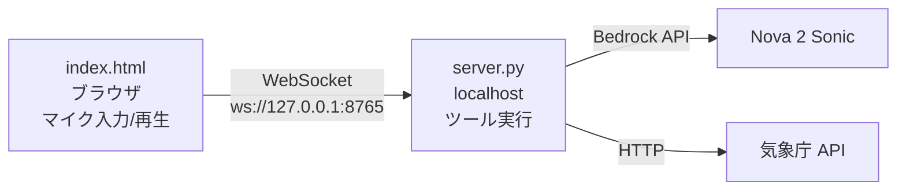

このリポジトリは AWS Deep Cuts の、Amazon Nova 2 Sonic に関するハンズオンコンテンツです。

<!-- TODO: 記事公開後にリンクを追加 -->
<!-- Amazon Nova 2 Sonicの解説記事(Qiita)は[こちら]() -->

# AWS Deep Cutsとは
AWS Deep Cutsは、AWS の最新のサービスやニッチな機能、または高度にアカデミックな知識を要求するサービスなど、多くの人が知らない 『隠れた名曲 = **Deep Cuts**』 を深くまで掘り下げる技術シリーズです。

このようなサービスはWeb情報も少なく、初学者は気軽にキャッチアップできないのが実情です。

そこで AWS Deep Cuts シリーズでは、**前提知識も含めた分かりやすいサービス解説** と **手順通りに進めれば誰でも再現できるハンズオン** を提供します！

## ハンズオンのゴール

このハンズオンでは、ローカル PC 上に Nova 2 Sonic のプレイグラウンドを構築し、**プロンプトを自由に書き換えながら** 以下の 8 つの観点を確認します。

1. 通常のプロンプトでは AI が自分から話しかけてこないこと
2. クロスモーダル入力 (Model-start-first) で AI から先に話しかけてくれること
3. 話者 (voiceId) を変更できること
4. 言語を変更できること（ポリグロットボイス）
5. ターンテイキングと割り込み (barge-in) が自然に動作すること
6. 話し方の抑揚・テンションが AI の応答スタイルにも影響すること
7. Tool use で外部情報（今日の天気）を取得できること
8. 発話スピード制御の制約を理解すること

## ハンズオン手順

以降の手順は、ローカル PC（Windows / macOS / Linux）で実施してください。

### 前提条件

- Python 3.9 以上
- AWS CLI 設定済み (`aws configure`)
- マイク付きの PC + Chrome / Edge ブラウザ

### １．セットアップ + サーバー起動

```bash
git clone https://github.com/AWS-Deep-Cuts/amazon-nova-2-sonic.git
cd amazon-nova-2-sonic/hands-on
python setup.py
```

> **Note**: macOS / Linux の場合は `python3 setup.py` を使用してください。

setup.py が認証確認・パッケージ確認を行い、WebSocket 中継サーバーを起動します。以下の表示が出れば準備完了です。

```
  WebSocket: ws://127.0.0.1:8765
  Security:  127.0.0.1 only (外部アクセス不可)

  index.html をブラウザで開いてください。
```

> **セキュリティ**: サーバーは `127.0.0.1` にのみバインドされます。外部からアクセスすることはできません。

### ２．ブラウザでプレイグラウンドを開く

`hands-on/index.html` をブラウザで直接開きます（ダブルクリックまたは以下）。

```bash
# macOS
open index.html

# Windows
start index.html

# Linux
xdg-open index.html
```

### ３．8 つの観点を確認する

以下の各観点について、プロンプトや設定を変更しながら動作を確認してください。

---

#### 観点 1: 通常プロンプトでは AI が自分から話しかけない

**確認手順:**
1. System Prompt をデフォルトのままにする:
   ```
   You are a friendly English conversation partner. Keep responses short (1-2 sentences). Respond in the same language as the user.
   ```
2. 「Start」を押してマイクを開始する
3. **何も話さずに 5〜10 秒待つ**
4. AI は沈黙したままであることを確認する

**理由**: Nova 2 Sonic は speech-to-speech モデルであり、ユーザーの音声入力を検知するまで応答を生成しません。

---

#### 観点 2: Model-start-first で AI から先に話しかけさせる

**確認手順:**
1. System Prompt を以下に書き換える:
   ```
   You are a friendly English tutor. As soon as the conversation starts, greet the student by saying "Hello! Welcome to today's English lesson. How are you feeling today?" Do not wait for the user to speak first.
   ```
2. 「Start」を押す
3. 画面下部のテキスト入力バーに `Start` と入力して Enter（Send）を押す
4. **何も話さずに待つ** — AI が System Prompt で指定した挨拶を音声で開始することを確認する

**仕組み**: Nova 2 Sonic は何らかのユーザー入力がなければ応答を生成しません。音声の代わりに**テキスト入力バーから短いメッセージを送信**することで、モデルに「今話し始めてよい」と合図できます。発話の内容を決めるのはあくまで System Prompt であり、テキスト入力は発火トリガーに過ぎません。

これが [Cross-modal input](https://docs.aws.amazon.com/nova/latest/nova2-userguide/sonic-cross-modal.html) を利用した "Model-start-first" パターンです。

---

#### 観点 3: 話者 (voiceId) の変更

**確認手順:**
1. Settings を開き、Prompt Config の `audioOutputConfiguration.voiceId` を確認する（デフォルト: `"matthew"`）
2. Start → 何か話す → 声を確認 → Stop
3. Prompt Config の `voiceId` を `"tiffany"` に書き換えて Start → 同じことを話す → Stop
4. `voiceId` を `"amy"` に書き換えて Start → 同じことを話す → Stop

```json
{
  "audioOutputConfiguration": {
    "mediaType": "audio/lpcm",
    "sampleRateHertz": 24000,
    "sampleSizeBits": 16,
    "channelCount": 1,
    "voiceId": "tiffany",
    "encoding": "base64",
    "audioType": "SPEECH"
  },
  "textOutputConfiguration": { "mediaType": "text/plain" }
}
```

**確認ポイント**: 同じプロンプト・同じ質問でも、voiceId によって声質・アクセントが明確に変わることを確認してください。

**制約**: voiceId はセッション開始時に決定され、セッション途中で変更できません（1 セッション = 1 voice）。

参考: [Language Support & Voices](https://docs.aws.amazon.com/nova/latest/nova2-userguide/sonic-language-support.html) — 利用可能な voiceId 一覧

---

#### 観点 4: 言語の変更（ポリグロット）

**確認手順 A — サポート言語（スペイン語）:**
1. Prompt Config の `voiceId` が `"matthew"` (ポリグロット) であることを確認する
2. System Prompt を以下に変更:
   ```
   You are a helpful assistant. Always respond in Spanish. Start by saying "¡Hola! ¿Cómo estás?"
   ```
3. Start → テキスト入力バーから `Start` と送信する
4. AI が**スペイン語で** "¡Hola! ¿Cómo estás?"（オラ！コモ エスタス？）と発話することを確認する

**確認手順 B — 非サポート言語（日本語）:**
1. Stop → System Prompt を以下に変更:
   ```
   You are a helpful assistant. Always respond in Japanese. Start by saying "こんにちは！"
   ```
2. Start → テキスト入力バーから `Start` と送信する
3. AI の挙動を確認する — 日本語は公式サポート言語ではないため、英語にフォールバックする、または不安定な発音になることがある

**ポイント**: matthew と tiffany はポリグロットボイスで、voiceId を変えずに 7 言語（英/仏/伊/独/西/葡/ヒンディー）を話せます。日本語・中国語・韓国語などは公式サポート外です。

参考: [Language Support & Voices](https://docs.aws.amazon.com/nova/latest/nova2-userguide/sonic-language-support.html)

---

#### 観点 5: ターンテイキングと割り込み (barge-in)

**ターンテイキングの確認:**
1. Settings を開き、Session Config の `turnDetectionConfiguration.endpointingSensitivity` を `"LOW"` に書き換えて Start
2. ゆっくり、途中で 2〜3 秒ポーズを入れながら話す（例: "I think... um... maybe... we should..."）
3. AI がポーズ中に割り込まず、発話完了を待つことを確認する
4. Stop → `endpointingSensitivity` を `"HIGH"` に書き換えて同じことを試す
5. AI が短いポーズで即座に応答を始めることを確認する

```json
{
  "inferenceConfiguration": { "maxTokens": 1024, "topP": 0.9, "temperature": 0.7 },
  "turnDetectionConfiguration": { "endpointingSensitivity": "LOW" }
}
```

**barge-in（割り込み）の確認:**
1. `endpointingSensitivity` を `"MEDIUM"` に戻して Start
2. AI に長い応答をさせる — 以下のように話しかける:
   ```
   "Tell me a long story about a cat who goes on an adventure"
   ```
3. **AI が物語を話している途中で**（3〜5秒後）、大きな声で割り込む:
   ```
   "Stop! What was the cat's name?"
   ```
4. 以下の 2 点を確認する:
   - AI が即座に発話を中断すること（音声がぴたりと止まる）
   - AI が中断前の内容を覚えており、猫の名前について回答すること（コンテキスト保持）

**仕組み**: Nova 2 Sonic はビルトインの VAD (Voice Activity Detection) でターン検出を行います。barge-in 時は `stopReason: "INTERRUPTED"` をクライアントに送信し、クライアント側で再生中の音声キューを即座にクリアします。コンテキストは保持されるため、中断前の話題について質問できます。

参考: [Barge-in](https://docs.aws.amazon.com/nova/latest/nova2-userguide/sonic-barge-in.html) / [Turn-taking Controllability](https://docs.aws.amazon.com/nova/latest/nova2-userguide/sonic-turn-taking.html)

---

#### 観点 6: 声の抑揚・テンションが応答に影響する

**確認手順:**
1. 同じ質問を**異なるテンション**で話す:
   - 1回目: 落ち着いた普通のトーンで "How are you today?"
   - 2回目: 非常に元気で高いテンションで "HOW ARE YOU TODAY!!"（大きな声で、高いテンションで）
   - 3回目: 疲れた小さな声で "how are you today..."（ぼそぼそと）
2. AI の応答のトーン・スピード・エネルギーが入力に応じて変化することを確認する

**仕組み**: Nova 2 Sonic は "Adaptive speech response" 機能を持ち、入力音声の prosody (韻律) に基づいて応答のデリバリーを動的に調整します。これは公式ドキュメントで明記されている機能です。

---

#### 観点 7: Tool use で天気情報を取得する

**確認手順:**
1. 「Tool use を有効にする」チェックボックスをオンにする
2. System Prompt を以下に変更:
   ```
   You are a helpful weather assistant. When the user asks about the weather, use the get_weather tool to fetch real data. Report the results naturally in speech.
   ```
3. Start → 「今日の東京の天気を教えて」と話しかける
4. ログに `Tool: get_weather` が表示され、AI が実際の天気情報を音声で報告することを確認する
5. 「大阪の天気は？」「福岡は？」など別の地域も試す

**仕組み**: Nova 2 Sonic が `toolUse` イベントを送信 → サーバーが気象庁 API を呼び出し → `toolResult` でモデルに結果を返す → モデルが結果を音声で報告する。

---

#### 観点 8: 発話スピードの制御（制約の確認）

**確認手順:**
1. System Prompt を以下に変更して Start:
   ```
   You are a helpful assistant. Speak very slowly and clearly, as if explaining to a young child. Take your time with each word.
   ```
2. 何か質問する — **AI の発話スピードはほとんど変わらないことを確認する**
3. Stop → 今度は自分が**非常にゆっくり**話しかけてみる（1単語ずつ区切って）
4. AI の応答スピードが入力に合わせてやや遅くなることを確認する

**制約（公式ドキュメントより）**: Nova 2 Sonic の発話スピードは**システムプロンプトで直接制御できません**。公式ドキュメントには以下のように明記されています:

> "While you can't control voice parameters directly, you can influence how natural and engaging the spoken interaction feels through the content generated."
>
> — [System prompt authoring guidelines](https://docs.aws.amazon.com/nova/latest/userguide/prompting-speech-speech.html)

発話スピードは、ユーザーの入力音声の韻律（prosody: ペース、抑揚、音量）に**適応的に調整**されます（観点6の Adaptive speech response）。つまり:

| 制御したいこと | 方法 |
| -- | -- |
| AI の応答のスピード | ユーザー自身がゆっくり/早く話す（入力 prosody に適応） |
| AI の応答の長さ | System Prompt で指示（"Keep responses to 1-2 sentences"） |
| AI の言葉遣い・スタイル | System Prompt で指示 |
| AI の声の高さ・速度パラメータ | **制御不可**（voiceId 固有の特性） |

参考: [Voice conversation prompts](https://docs.aws.amazon.com/nova/latest/nova2-userguide/sonic-system-prompts.html) / [Prompting best practices](https://docs.aws.amazon.com/nova/latest/userguide/prompting-speech-best-practices.html)

---

### ４．後片付け

サーバーを Ctrl+C で停止します。

```bash
bash cleanup.sh
```

Nova 2 Sonic は Bedrock のオンデマンド API のため、AWS リソースの削除は不要です。

## アーキテクチャ



- **セキュリティ**: server.py は `127.0.0.1` にのみバインド。外部ネットワークからアクセスできません。
- **認証**: AWS CLI のクレデンシャルを使用。ブラウザに認証情報は渡しません。
